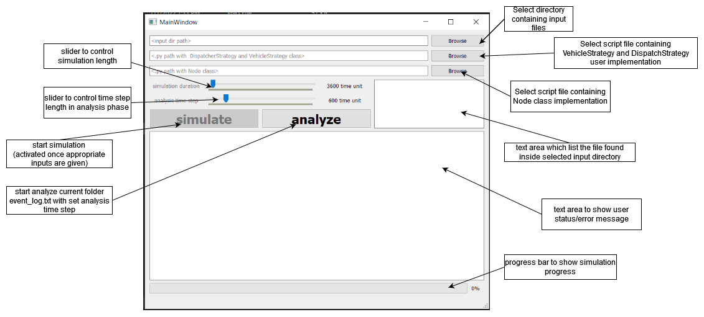

# Transit Network Simulator

This repository contains a transit network simulation framework written in Python3 based on simpy package. Included features are
 - cmd line simulator
 - Qt5 UI for cmd line simulation tool
 - event log analysis and some graph generation
 - cmd line tool for network congestion visualization based on networkx and matplotlib

With each release a zip will be provided which contains a folder containing windows executable built using pyinstaller5.1

## Requirements
Tested with Python3.9
Exes are run and tested in Windows 10

## Tools

### cmd line simulation
run main.py to run cmd line simulation
```
> python .\main.py
```
Output should be
```
usage: main.py [-h] -input INPUT_DIR [-sim] [-simtime SIMULATE_TIME_LENGTH] [-al] [-ts TIME_STEP] -ds DISPATCH_STRATEGY -vs VEHICLE_STRATEGY [-velplot AVGVELOCITY_PLOT]
               [-eplot EVACTIME_PLOT] [-tplot TRIPCOMPLETE_PLOT]
main.py: error: the following arguments are required: -input/--input_dir, -ds/--dispatch_strategy, -vs/--vehicle_strategy
```

Corresponding exe is "transport_simulator_cmd.exe"

### simulator UI


Corresponding exe is "transport_simulator.exe"

### visualizer cmd line tool

run network_visualizer.py to visualize network based on given input
```
> python .\network_visualizer.py
```
Output should be 
```
usage: network_visualizer.py [-h] -dir INPUT_DIR -elog EVENT_LOG [-ts TIME_STEP] [-dur DURATION]
network_visualizer.py: error: the following arguments are required: -dir/--input_dir, -elog/--event_log
```

Corresponding exe is "visualizer.exe"